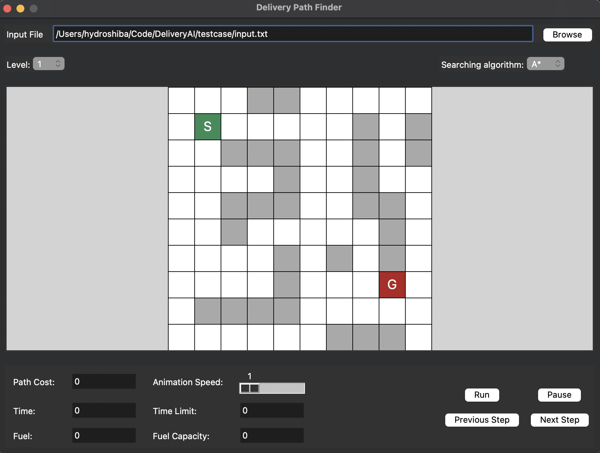

# Introduction to Artificial Intelligence: Delivery AI Project

**Built by:**
- Phan Hải Minh ([hydroshiba](https://github.com/hydroshiba))
- Mai Đức Duy ([EvDDD](https://github.com/EvDDD))
- Nguyễn Trần Minh Hoàng ([hoangcoderne](https://github.com/hoangcoderne))
- Trần Thành Long ([lib2509](https://github.com/lib2509))

During our course **CSC14003: Introduction to Artificial Intelligence** we explored searching problems and how to solve them using various algorithms. This project is a simulation of a deliveryman with the task of delivering packages to customers on a map. The deliveryman has to find the shortest path to arrive at the destination under several constraints including time limit and fuel capacity.

 

 

The detailed description of the project can be read in the [project description PDF](./docs/pdf/description.pdf).

## Requirements

- Python 3.8 or higher.
- `tkinter` package.

## How to run

- Clone the repository.
- Install the `tkinter` package if you haven't already.
- Execute the `main.py` file in the repository directory with Python.

To see how the program works, watch our [demo video](https://www.youtube.com/watch?v=jYYZUnpD_8E).

## Project details

For a detailed description on each of the algorithms used in each level of the project, as well as the testcases used to test these algorithms, read the [project report](./docs/pdf/report.pdf).